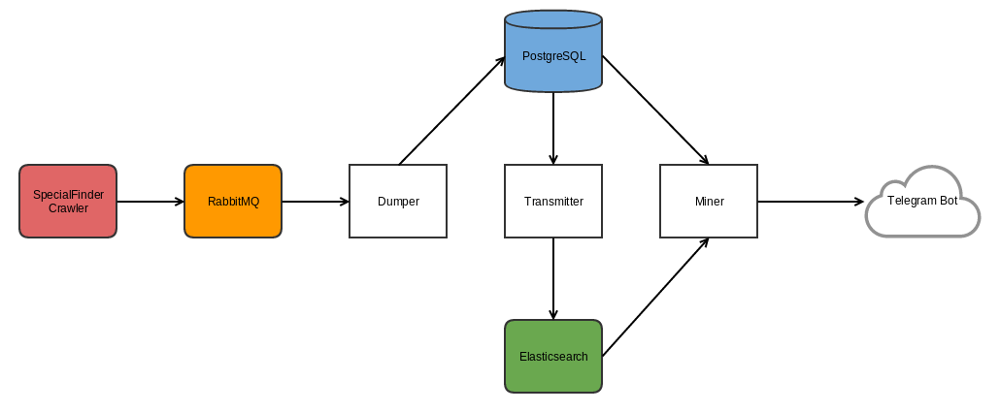

# SpecialFinderMiner
It's part of my SpecialFinder project. The SpecialFinderMiner reads the crawl results by [SpecialFinderCrawler](https://github.com/janusle/SpecialFinderCrawler) from a RabbitMQ queue and writes them to the
database(PostgreSQL) and Elasticsearch then does some search/mining on the data and notifies me via a
Telegram bot when it finds something I may be interested in.

## Architecture



*Note: The squares in white are the components of SpecialFinderMiner*

* Dumper: Long-running service reads the crawl results from RabbitMQ and writes to PostgreSQL
* Transmitter: A program syncs database to Elasticsearch
* Miner: A program analyses the data in the PostgreSQL and Elasticsearch and tries finding products I may be interested in then sends to a Telegram bot to notify the user.

### Development:

Install development dependencies
```bash
pip install -r requirements.txt
```

Run local PostgreSQL and Elasticsearch
```bash
docker-compose up
```

Run miner locally
```bash
make miner
```

Run transmitter locally
```bash
make transmitter
```

Run dumper locally
```bash
make dumper
```
